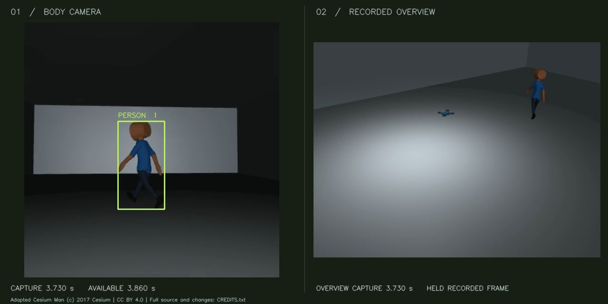
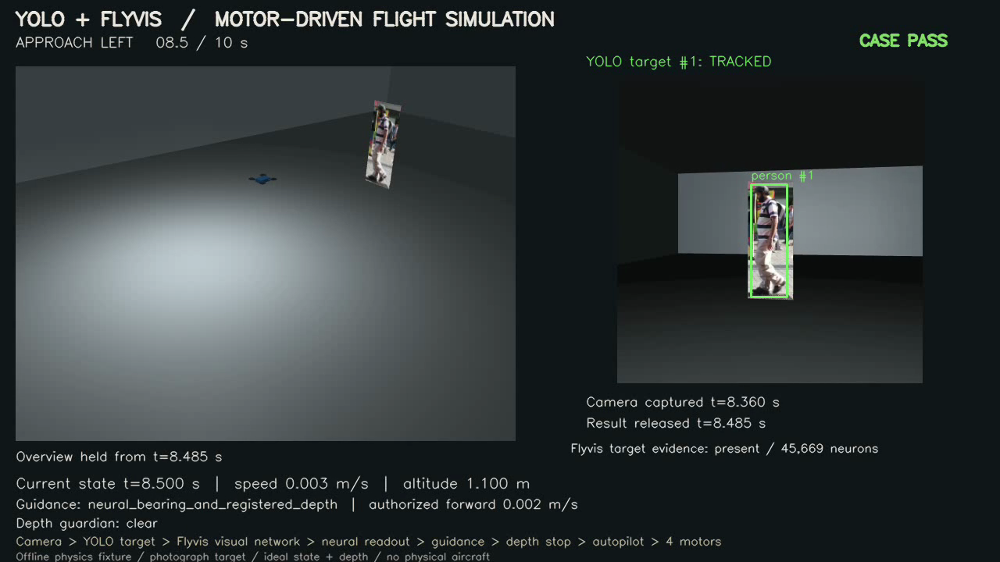

# Mantis

[](https://github.com/Manavp7/drone-flybrain/actions/workflows/tests.yml)

An experimental drone simulator combining **YOLO person tracking, a recurrent Flyvis visual neural network, depth-based stopping and four-motor flight physics**.

**Mantis** is the project name. Flyvis remains the credited upstream visual neural model.

## Interactive Flight Studio

The new local studio runs simulations from the browser: choose a detected person,
pause/resume, change follow distance and target motion, and watch camera, neural
and motor telemetry. Two-person scenes stop on ambiguous selection. A bounded
depth planner can attempt short detours around an offset obstacle.

```bash
# After installing the existing research runtime, models and ffmpeg below:
python -m experiments.mantis_studio
```

Open [Mantis Studio](http://127.0.0.1:8875). Compact videos/results are the default;
raw research arrays are optional. Recording has a per-run limit and the studio
defaults to a 256 MiB total budget without deleting old runs.

An independent raw-camera Flyvis arm can measure motion or experimentally reduce
speed alongside YOLO guidance. The latest controlled checks passed **3/3 obstacle
detours** and both raw-motion modes: fresh neural output reached the controller,
and the brake reduced a command that depth safety would otherwise allow.
Its frozen motion benchmark still **did not outperform conventional optical
flow**; runtime fixes preserve the same neural outputs. See the
[remediation evidence](evidence/mantis_studio_remediation/README.md) for results
and the preserved failures. [Studio guide](docs/MANTIS_STUDIO.md) ·
[Motion methodology and evidence](docs/MANTIS_MOTION.md).

The combined native suite passed **821 tests**. All **16 new videos** from the
three failed probes and five final trials decoded successfully; the earlier
28-video check remains preserved. These controlled fixtures do not establish
general navigation, identity recognition, neural superiority or physical flight.

## Mantis 2.1

The new experiment replaces the photograph with an **animated, skinned 3D actor** and compares **Mantis Neural**, **Direct YOLO** and **Alpha-beta** guidance. Each controller flies its own motor-driven simulation. A separate benchmark feeds identical recorded detections to all three estimators, with clean input, seeded jitter and brief gaps.

The offline replay lab includes controller/case selection, synchronized camera and overview video, scrubbing, motor telemetry, actual neural features and comparison metrics. See [Mantis 2.1](docs/MANTIS_V2_1.md) for methodology, fixes and measured results. The actor is stylized; this is not real-human or hardware validation.

Mantis 2.1 retains bounded association memory across detector delays while keeping result freshness and command expiry unchanged. Its obstacle test requires fresh person guidance and paired depth captures that isolate the barrier's braking effect. A broader neural readout calibration improves held-out synthetic cue reconstruction; it does not establish a neural advantage over conventional guidance.

The frozen nominal and shifted-path batches passed **36/36 operational trials**, including all six depth-braking trials and twelve delay/recovery trials. The native software suite passed **686 tests**. Neural guidance still did not beat the strongest conventional estimator in any of the **20 matched bearing comparisons**; [complete results and limits](docs/MANTIS_V2_1.md) preserve that outcome.

The preserved [original V2 suite](docs/MANTIS_V2.md) passed **8/12** operational trials and **614 software tests**. Its filtered tracking loss and three unproven depth-braking trials remain recorded as failures. They are not regraded by the new evaluation.

[](docs/MANTIS_V2.md)

After the model setup below, run:

```bash
python -u -m experiments.mantis_flight --output results/mantis_run
python -u -m experiments.mantis_flight --validation-fixture --output results/mantis_validation
python -m experiments.mantis_report --run results/mantis_run
python -m experiments.mantis_report --serve results/mantis_run/report --port 8874
```

Open `http://127.0.0.1:8874` for the recorded flight lab. The server stays on localhost. Every run/export needs a new output directory. A short probe can use `--development --case walk --method mantis_neural --duration 4 --skip-benchmark`; shortened runs are not full acceptance trials.

YOLO locates the target. A target cue drives the actual Flyvis network, whose neural activity feeds a frozen learned readout for visual guidance. A conventional autopilot stabilizes the simulated aircraft. Movement changes the next camera image, closing the loop.

[Watch the V1 80-second demo](assets/flight-demo.mp4) · [V1 measured results](docs/MOTOR_FLIGHT_TEST.md) · [Model setup](docs/MODEL_SETUP.md) · [Media attribution](assets/ATTRIBUTION.md)

## What works

| Component | Implementation |
|---|---|
| Recognition and temporary target tracking | Official YOLOX-tiny through OpenCV, geometric/clothing association, camera-motion compensation |
| Visual neural processing | Actual frozen Flyvis model: 45,669 neurons; eight readout features from 721 L2 cells |
| Guidance | Neural bearing plus registered target-surface depth for standoff |
| Safety | Wide-depth stopping gate; missing, stale or unsupported observations prevent forward movement |
| Stabilization and physics | Conventional autopilot, four rotor forces, motor lag and MuJoCo six-DOF dynamics |
| Timing | Capture-anchored deadlines; earlier commands remain active while simulated time advances through measured inference delay |

This is a **research simulation**, using ideal depth/state sensors. V1 uses a photograph; V2 and Studio use stylized animated actors. Flyvis is a visual-network component, not a whole fly motor brain. Physical aircraft, real-time onboard execution, PX4 integration, general aerial person recognition and general route planning are not demonstrated.

## Recorded V1 results

[](assets/flight-demo.mp4)

The predeclared nine-scenario run passed all gates: left/right approach, moving target, target loss, obstacle stop, missing depth, stale depth, delayed inference and zero-neural-feature ablation.

- **312/312** normal-case observations retained the selected person and passed the approximate photograph-overlap check.
- **732 actual YOLO calls and 732 Flyvis observations**, with 16,000 motor-physics steps.
- All injected failure scenarios stopped; the obstacle case retained at least **0.286 m** conservative planar clearance.
- Zeroing the supplied neural features prevented pursuit while YOLO continued tracking.
- **498 tests passed** in the original native-rendering environment. Independent saved-array reconstruction checked tracking and neural readouts; a separate replay reproduced every motor-physics step.

Eighty simulated seconds took **140.25 seconds** of summed episode wall time. These controlled results establish a connected prototype, not broad tracking accuracy or biological superiority. Earlier pure-Flyvis real-person tracking and overhead detector failures remain unresolved; see [research history](docs/RESEARCH_HISTORY.md).

The public [evidence folder](evidence/README.md) contains a compact results subset. Multi-gigabyte raw captures, checkpoints and original videos are not bundled.

## Install and run tests

Use **Python 3.12**. The development machine was Apple ARM64; CI exercises Linux. The unit suite needs no model weights and performs no model downloads.

```bash
git clone https://github.com/Manavp7/drone-flybrain.git
cd drone-flybrain
python3.12 -m venv .venv
source .venv/bin/activate
python -m pip install -r requirements-test.txt
python -m unittest discover -s tests -v
```

The original public release added 17 model-setup checks and passed **515 tests** in a fresh native-rendering environment. The preserved Mantis 2.1 suite passed **686 tests** locally; the current suite including Studio passed **821 tests**. Camera-rendering tests are skipped by default. With a working native OpenGL context, enable them:

```bash
FLIGHT_RENDER_TESTS=1 python -m unittest discover -s tests -v
```

On a headless Linux machine, native graphics need a suitable display or EGL setup. CI uses a virtual X display. The hardware-free tests check contracts and generated fixtures; they do not repeat trained-model inference.

## Model setup and original V1 flight

Install `ffmpeg` separately for the exported video (`ffprobe` is also required by recorded-video tools). Install the optional neural runtime, acquire the upstream model artifacts, and verify them as described in [model setup](docs/MODEL_SETUP.md):

```bash
python -m pip install -r requirements-research.txt
python scripts/fetch_yolox.py --variant tiny --output-dir models/yolox_tiny_official
python scripts/prepare_flyvis.py --archive /path/to/results_pretrained_models.zip
```

The Flyvis checkpoint is not distributed here. Its upstream acquisition and weight terms are separate from this repository's software license. The helper verifies the pinned archive and five selected model files and refuses mismatches or overwrites.

Start with one short development case:

```bash
python -u -m experiments.flight_demo --development --case approach_left --duration 4 --output results/my_smoke
python -m experiments.flight_report --run results/my_smoke
```

A shortened development run is not expected to satisfy the full-duration acceptance gates; inspect its capture, inference and motor outputs. For the complete nine-case suite:

```bash
python -u -m experiments.flight_demo --output results/my_flight_run
python -m experiments.flight_report --run results/my_flight_run
```

Every output directory must be new. Export can resume from completed saved observations without rerunning the models. Processing speed and resulting observation counts depend on your machine because measured inference delay is included in the simulation.

## Repository map

| Path | Purpose |
|---|---|
| `experiments/flight_*.py` | Connected motor-flight fixture, tracking, guidance, safety and reporting |
| `experiments/mantis_*.py` | Animated actors, controller comparison, replay lab and interactive Studio |
| `experiments/hybrid_*.py` | Neural readout, target cue and earlier hybrid/video experiments |
| `perception/` | YOLOX, short-term tracking, registered depth and video/image interfaces |
| `flybrain_sim/`, `stress/`, `validation/` | Preserved earlier navigation and evaluation software |
| `integrations/gazebo/` | Observation-only ROS/Gazebo camera bridge; local flight integration remains unverified |
| `tests/` | Unit, numerical, physics and optional rendering checks |
| `results/hybrid_flight_run01/` | Four small, versioned calibration/photo fixtures required by the unchanged experiment |
| `evidence/` | Selected recorded scores and verification receipts |

The earlier experiment tools are retained for research continuity. Some require source clips or raw outputs that are intentionally not included. The quickstart above targets the connected motor-flight experiment.

## License and credits

Project software is licensed under **Apache-2.0**; see [LICENSE](LICENSE) and [NOTICE](NOTICE). The photograph, demo screenshot and video contain **CC BY 3.0** media by Vicente Quintero / QuinteroP, with modifications and attribution documented in [assets/ATTRIBUTION.md](assets/ATTRIBUTION.md).

The V2 actor adapts Cesium Man under **CC BY 4.0**; its source, changes and separate trademark notice are documented in [actor attribution](assets/mantis_actor/ATTRIBUTION.md).

YOLOX, Flyvis and MuJoCo are upstream projects with their own notices and artifact terms. See [THIRD_PARTY_NOTICES.md](THIRD_PARTY_NOTICES.md). No model-weight redistribution license is implied by this repository's code license.
