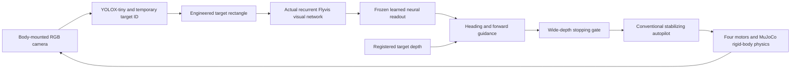

# YOLO + Flyvis motor-flight simulation

**Publication note:** this report describes the original complete local experiment. The public repository includes [selected scores and review receipts](../evidence/README.md), the demo, source and four required calibration/photo fixtures. References below to full raw results, development archives, test logs and historical integrity locks describe local records that are not bundled. Public setup and verification are documented separately.

Verified 2026-09-14 IST. The connected local simulation passes all nine predeclared scenarios and all 498 code tests. It now includes a moving camera on a six-degree-of-freedom quadrotor, four motor forces, conventional stabilization, registered depth stopping and measured perception delay. Physical aircraft operation and PX4 integration remain unverified.

[Watch the 80-second result](../assets/flight-demo.mp4) · [Full scores](../evidence/flight-summary.json) · [Frozen scenario definitions](../evidence/flight-definition.json)

## What the fly network does



YOLO recognizes and tracks the person. An engineered rectangle at the selected detection drives the actual frozen Flyvis network: 45,669 modeled neurons, with a 721-cell L2 population supplying eight readout features. The existing frozen ridge readout estimates the target bearing from these neural features. Registered target-surface depth supplies metric standoff, while a conventional controller handles altitude, attitude and rotor mixing. Camera pose/depth also compensate for camera motion during track association.

This is a biological visual-network component connected to engineered flight software. It is not an entire fly motor brain, and Flyvis does not independently recognize people or interpret the full camera image. Zeroing the supplied neural features leaves YOLO tracking active but prevents pursuit; that demonstrates a required neural connection, not an advantage over a conventional visual controller.

## Actual results

The normal test poses were frozen after development and before final inference. Failure scenarios start moving, then receive their declared fault at 3.5 simulated seconds. The final suite uses unchanged model weights and the previously fitted readout; no fitting or threshold changes followed these results.

| Scenario | Actual observation count | Result |
|---|---:|---|
| Approach from left | 95 | Same ID in 95/95 captures; moved 1.576 m and settled near 3.5 m optical standoff |
| Approach from right | 99 | Same ID in 99/99 captures; moved 1.497 m and settled near 3.5 m optical standoff |
| Moving target | 118 | Same ID in 118/118 captures; moved 1.152 m while following lateral motion |
| Target disappears | 79 | Explicit tracking loss; maximum speed after the two-second settling allowance was 0.00133 m/s |
| Obstacle appears | 66 | Depth stop, no contact; conservative planar surface clearance at least 0.286 m |
| Wide-depth input disappears | 78 | Stopped despite continued valid YOLO tracking in all 78 captures |
| Wide-depth input becomes stale | 79 | Stopped despite continued valid YOLO tracking in all 79 captures |
| Inference delay increases by 1 s | 38 | Stale results rejected; maximum settled speed 0.00718 m/s |
| Supplied neural features zeroed | 80 | YOLO retained ID in 80/80 captures; no pursuit or meaningful translation |

All 312 normal-case captures pass the approximate projected-photograph overlap threshold of IoU 0.5. Normal tail mean absolute horizontal error was 0.00748, 0.00906 and 0.01237 in normalized image coordinates. Tail optical standoff errors were 0.00127, 0.00647 and 0.00640 m. Maximum altitude deviation over all nine cases was 0.001704 m; maximum normal speed was 0.5021 m/s. The requested speed cap is 0.45 m/s; the physical controller has transient overshoot, bounded by the predeclared 0.65 m/s test limit.

In the obstacle test, the obstacle also occludes the person. The depth gate independently suppressed a still-positive forward request for 27 physics ticks before tracking-loss handling took over. Missing and stale depth suppressed positive guidance for 900 and 889 ticks respectively. These tests verify braking, not planning a route around an obstacle.

The ablation is an expected absence-of-pursuit test. Its pass does not mean it centered the target. Likewise, low post-disappearance overlap is the intended loss condition, not a normal tracking success.

## Physics, depth and timing

- MuJoCo 3.2.7 rigid-body physics at 200 Hz; 0.8 kg body, gravity, four bounded thrusts, reaction torques and 40 ms motor lag. Only rotor actuators move the aircraft after initialization. Motors begin pre-spun for the hover fixture.
- Ideal state sensing; world/body axes are X forward, Y left, Z up. Camera optical axes are X right, Y down, Z forward. Target guidance uses capture-time calibrated camera pose.
- Primary RGB-D camera: 391 square, 70-degree field of view. Separate safety RGB-D: 192 square, 150-degree field of view, refreshed at 20 Hz. Both are body-mounted 0.25 m forward.
- The safety gate inspects every depth pixel, backprojects optical Z, checks the observed forward corridor, and includes body size, margin, observation age, stopping distance and transient braking reserve. Unknown, missing, stale, unregistered or unobservable space prevents forward authorization.
- Forward movement only, near the current heading, at fixed 1.1 m altitude and nominal 3.5 m optical standoff. The current body footprint is assumed initially free. Side/rear motion and global navigation are not certified by this camera gate.
- Perception estimates older than 0.65 s are rejected. Command expiry remains anchored to capture plus 0.90 s. Every physics/depth/controller tick advances through measured computation delay using only earlier released commands. Results completed beyond episode end are retained as discarded observations and never applied.

Final execution used **732 actual YOLO calls, 732 actual recurrent Flyvis observations, 3,660 neural integration steps, 16,000 physics ticks and 1,420 fresh wide-depth frames**. There were 1,600 scheduled depth events; missing/stale injections explain the difference.

Measured capture-plus-inference duration: median **91.2 ms**, 95th percentile **111.6 ms**, maximum **668.1 ms**. The explicit extra one-second fault is recorded separately. A minimum modeled response interval of 0.1 s is used. Eighty seconds of simulated episodes took **140.25 seconds of summed episode wall time**, excluding initial model setup and final export. This serial offline scheduler is not an achieved concurrent real-time flight runtime; visualization, evidence serialization and physics work have separate wall costs.

## Changes and development failures

New experimental modules are `flight_contracts`, `flight_world`, `flight_autopilot`, `flight_safety`, `flight_guidance`, `flight_tracking`, `flight_vision`, `flight_demo` and `flight_report`. Existing navigation packages and historical experiments remain unchanged.

The first four-second integrated development run lost the selected track after camera rotation/pitch moved its image box. YOLO still detected the person, but plain consecutive-frame IoU assigned a different ID. The fix reprojects each prior observed box using registered depth and calibrated camera motion before the existing IoU/clothing association. It never refreshes an old observation's age without a new detection or automatically selects a new ID. The saved failure remains in `results/flight_integration_development01`; its 13-frame association replay now retains the original ID. A separate fresh ten-second development run passed before final scenarios were frozen.

Braking probes found that an accelerating, tilted drone can continue moving even if its current speed is small. The stopping reserve therefore includes 0.15 m for transient attitude recovery in addition to a 0.35 m/s² effective braking bound. Eight acceleration-phase and twelve seeded transient probes passed. Native camera tests cover depth on known planes and nonzero camera roll/pitch/yaw. An enclosed room provides observed ceiling depth; sky or missing depth was not reclassified as free space.

YOLOX-tiny was selected during development using the official 416-input ONNX artifact. Its fixed-image warm inference took 70–102 ms, versus 271–299 ms for the existing S model on those images. Both detected the primary foreground person. This small probe is not a general accuracy comparison and does not repair the earlier overhead-person classification failure.

## Verification and saved evidence

- `results/flight_validation01/full_tests.log`: **498/498 combined tests passed** in 18.488 s, including native graphics checks. The 100 new tests cover physics/autopilot, depth safety, guidance timing, camera-motion association and report coverage/causality.
- `results/flight_validation01/root_replay.json`: coordinator verification of all **2,247 original artifact hashes**, 17 frozen runtime/evaluator sources, 54 additional dependency snapshots, all candidate releases, all depth decisions, all conventional motor outputs and a fresh replay of all **16,000** rigid-body physics steps. Saved numerical values agree within 1e-10. This replay does not rerun learned inference.
- `results/flight_validation01/independent_reconstruct.json`: a separate reviewer independently reconstructed all **732 captures, 1,257 camera-motion reprojections and 1,212 detection associations/anchors**, using saved RGB-D and calibration without recorded track IDs as association inputs. All masks and supplied feature rows match; all 33,429,708 saved activity values are finite. Maximum reprojection error is zero, L2 feature error 8.67e-19, retinal sampling error 5.83e-7 and heading error 2.05e-16. Source review found no target-truth input to tracking, vision or guidance. This reviewer authored the report module, so its independent certification covers the neural/tracking path rather than its own scoring code.
- Original `flybrain_sim`, `stress` and `validation` package hashes still match the frozen controller release. Prior model/readout weights, failures and historical locks are preserved.
- `results/flight_run01` holds predeclared definitions and thresholds, source snapshots, model provenance, XML worlds, capture/completion times, raw RGB-D/retina/neural arrays, camera poses, depth events, rotor commands, physics states and evaluation-only target geometry.
- H.264 preview: **800 fully decoded frames, 1280×720, 10 FPS, 80 seconds**. Root inspected approach, moving-target, target-loss, obstacle-stop and zero-feature images. The preview displays only results already completed at the shown simulation time and labels the separate camera capture and held overview times.

The original raw manifest is retained unchanged. `final_artifact_hashes.json` adds report/video integrity without rewriting it; `experiments/flight_lock.json` records the final source, dependency, model and evidence chain.

## Run again

Use Python 3.12 and the [public quickstart](../README.md). Install `requirements-research.txt`, acquire YOLOX-tiny and prepare the separately acquired Flyvis archive using [model setup](MODEL_SETUP.md). The repository includes the frozen readout and photograph, with [CC BY 3.0 attribution](../assets/ATTRIBUTION.md).

```bash
python -u -m experiments.flight_demo --output results/flight_new
python -m experiments.flight_report --run results/flight_new
```

Each run needs a new directory. Export requires `ffmpeg` and can run after completed inference without repeating the models. Native rendering needs a working OpenGL context. On the development macOS host a restricted command sandbox could not create its CoreGraphics connection; normal graphics access succeeded. The renderer reported unavailable `ARB_clip_control`, while actual plane-depth calibration checks passed. These tests do not qualify a real sensor.

## Remaining boundaries

The person is a fixed vertical textured photograph from the previously documented source video, with some background included. The moving scenario translates that board. It is not a walking 3D human, diverse crowd dataset or outdoor aerial benchmark. The test has ideal depth and state, an enclosed room, no wind and no physical sensor failures beyond the explicit injections. Clothing association and geometric compensation do not solve long occlusions or similar-looking-person identity.

No PX4/Gazebo/ROS/VM runtime was installed on this host. The preserved PX4 runner expects Linux and a different non-camera vehicle identity; that integration was not bypassed. A pinned camera-equipped PX4/ArduPilot simulation, asynchronous load/latency validation, real sensor calibration and hardware-in-the-loop/aircraft testing remain separate acceptance work. No motor commands were sent to hardware.

The earlier real YouTube test is described in [research history](RESEARCH_HISTORY.md). Its prerecorded camera cannot respond to simulated drone movement, so its video-tracking evidence and this motor-flight fixture answer different questions.

Sources: [MuJoCo 3.2.7 Python API](https://mujoco.readthedocs.io/en/3.2.7/python.html), [MuJoCo model reference](https://mujoco.readthedocs.io/en/3.2.7/XMLreference.html), [official YOLOX model release](https://github.com/Megvii-BaseDetection/YOLOX/releases/tag/0.1.1rc0). Exact model download and photograph attribution are preserved with the run.
